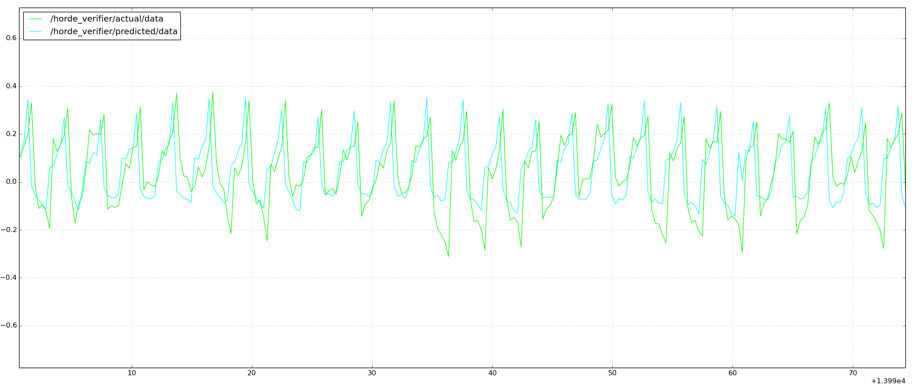
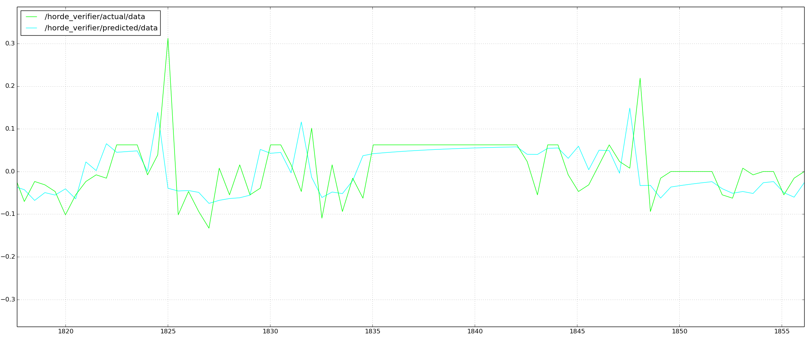

# General value functions in robots
An ability to predict future outcomes is powerful for any type of intelligence - human or artificial. A child able to predict it will fall off it’s bicycle if it continues down the hill; a child that is able to predict it won’t fall off it’s bicycle if it applies the breaks; a car that’s able to predict how long it will be able to drive before running out of gas.; a hockey player who predicts she will go offside if she doesn’t slow turn. These are examples of predictions that represent knowledge that can inform the intelligent agent what might be wise to do next.

General value functions are an attempt to articulate and answer these questions in a computationally efficient way, using only the agents sensorimotor inputs. In this project we look to explain the framework used for testing such a system, as well as exploring the results of three such questions to our system.

## GVF System:
Our system includes a “robot” controlled and monitored by our learning algorithms.

The robot consists of one dynamical servo, and python code to instruct the robot, monitor the sensorimotor outputs, and learn from them. ROS is used to control messaging between components (nodes) of the system (the dynamixels, plotting, control code, learning code), as well as for data plotting.

## Question 1: How long until we get there?
We constructed an incredibly simple policy that had the robot oscillate back and forth from extreme encoder positions. At each time step, it would move to the opposite extreme. At each of these steps, we wanted to be able to predict how long it would take to get to the right most point of interest (state 2 below). Given the policy, it’s easy to see that the robot was either 1 or two time steps away from the point of interest:

On/Off Policy: On policy
number of Tiles: 8
number of Tilings: 8
state representation: {encoder, speed}
cumulant: time step. Always 1
alpha: (step size) 0.1 / Number of Tilings
beta: NA
lambda: 0.95
behavior policy: If extreme left, move to the extreme right. If extreme right, move to extreme left
target policy: NA (On policy)
gamma: state dependent. 0 if in the right most state (encoder position of 1023). 1 otherwise.
rho: NA
update frequency: 2 seconds per update. This is slow, but for simplification, we wait until the servo pivots to the extreme so we don’t have to deal with intermediate states. verifier queue size 3

### Results.
As can be seen by the graph below, the algorithm quickly approximates the correct values, as confirmed by the verifier. When the servo is already at the extreme right, it is 2 steps away from returning there. When it’s on the extreme left, it’s just one step away from returning.

### Lessons Learned:
- Ross float vs. int. We were broadcasting the predicted and actual returns as integers. Therefore the graph rounded these actual values down. So our predictions, which should have been ~1.9... were showing up as 1. And 0.9.... were showing up as 0.
- Our state space couldn’t possibly be more tabular. The possible values were either {encoder=1023, speed =0}, or {encoder=510, speed = 0}. But yet we used function approximation to estimate our current space. We’re still able to predict the values, but there’s a lot of unnecessary complication.
- Too large of an alpha. My initial alpha was not divided by the number of Tilings. Therefore, the estimates blew up quickly.

## Question 2: “How long until we get there if we go straight?”
The question above regarding how many more time intervals to get to a destination given a very simple policy is interesting. But we wanted to make it a bit more interesting and challenging for our robot. We did so in the following ways:
- we introduced a random policy. The policy would most often repeat its previous action, but often take one randomly.- We increased the update frequency to 0.2. Meaning that 5 times per second the robot could potentially change directions, and learn from it. This meant that the state space grew to a near continuous space, instead of the tabular case.
- The question we asked was no longer “how long until we get there given our current policy?”, but instead “how long until we get there if I were to go straight there?”

On/Off Policy: Off policy
number of Tiles: 8
number of Tilings: 8
state representation: {encoder, speed}
cumulant: time. Always 1
alpha: (step size) 0.1 / Number of Tilings
beta: 0.1 * alpha
lambda: 0.95
behavior policy: actions: {continually move left, continually move right}. policy: {60% - repeat previous action, 40% - pick action randomly}
target policy: Always move right
gamma: state dependent. 0 if in the right most state (encoder position of 1023). 1 otherwise.
rho: 1 if action was right. 0 otherwise.
update frequency: 0.5 seconds per update.
verifier queue size: NA

### Results:
Measuring whether our algorithm was performant or not is tricky for this off-policy question since the verifier can not use prior experience to naively estimate actual return. So we used our own intuition to see whether the algorithm was correct. For testing purposes, I set the dynamixels position to the extreme right, and changed the behavior policy to move right at each step. Doing so, I was able to measure that from that position, it took 3 time steps to get to the extreme right. Therefore, it is known that the range of “true” prediction values is between 3 (at the extreme left) and 1 (at the extreme right). We should be able to see the learning algorithm converge to this. As seen in the graph below, the predictions do indeed stay within these bounds. Along with the predicted return is the normalized current encoder position being predicted. A high value encoder position indicates that it’s close to the extreme right, so the prediction should be low. A low current position indicates it is close to the extreme left, so the prediction should be high. This is what we see in the graph.Load

### Lessons learned:
- The strategy for determining the value for rho was rather naive. This meant that the learning opportunities were rather minimal. Experimenting with different ways to determine rho would likely speed up learning.

## Question 3: “How much load can I expect at any position?”
Rather than predicting “how long,” we looked to predict the amount of future load that our robot would experience at any given state. To make this interesting, I wrapped an elastic band around the robots limb in such a way that the load would increase and decrease depending on where it was located. Our policy was to basically oscillate back and forth between extreme left and extreme right. But unlike the first question above, the update frequency was high, such that the agent experienced several states between the two extremes.On/Off Policy On policy

On/Off Policy: On Policy
Number of Tiles: 8
Number of tilings: 8
state space: {encoder, speed}
cumulant: load
alpha: 0.1 / Number of Tilings
beta:  0.1 * alpha
lambda:  0.95
behavior policy: {continually move left, continually move right}. policy: {continue to move left if not at extreme left, continue to move right if not at extreme left}  |
target policy: NA
gamma: 0.5. Therefore, this translates into a 2 time step prediction about load.
rho: 1 if action was right. 0 otherwise.
verifier queue size:50

## Results:
Because this was on policy, we were able to use our verifier to measure actual load vs.
predicted load. As per the graph, our predictions seem to converge closely with the actual load.

I also ran an an experiment where the behavior was random. The predictions made weren't quite as accurate, but seemed to be doing a reasonable job. I didn’t spend much time tuning the parameters.

Lessons learned:
- State conflation. I originally only had the current encoder position included in the state. But this conflated two different states into one. The direction the servos was rotating would have a big impact on the measured load. ie. if you’re lifting a stone vs. letting it pull you down. But yet, those two states collapsed into one, making the predictions an average of the two. Adding speed (which is negative for one direction, positive for the other) resolved this.
- There are a few anomalies. I believe they are potentially due to the following things:
- Our policy is such that there ranges of states that are rarely experienced. Therefore, when they are, perhaps the value predicted is inaccurate. We could test this by increasing the number of updates per second.
- The rubber band was actually starting to shift around a little as it moved in a stochastic way. So perhaps there was some noise in the actual cumulants being received. I could test this by harnessing my servos with a more permanent setup than an elastic hair elastic.
- After the predictions stabilized, I wanted to see how quickly my algorithm would adapt if I changed the environment. So I literally grabbed the servo and provided manual resistance. It was only for about 10 seconds, the actual returns clearly changed, and it appeared my predictions slowly started to adapt. But then the servos literally shut down. Perhaps I overheated them. I would have liked to have performed similar experiments with a more consistent dynamic environmentParameter tuning: In the process of getting these predictions, we “experimented” with parameters, only in such a way to get the algorithms to converge. Number of tiles, number of tilings, alpha, beta, gamma, and rho were all different values before being set to the values seen in the above charts. However, we didn’t so much “tune” these parameters in an attempt to achieve algorithmic precision or faster convergence.
