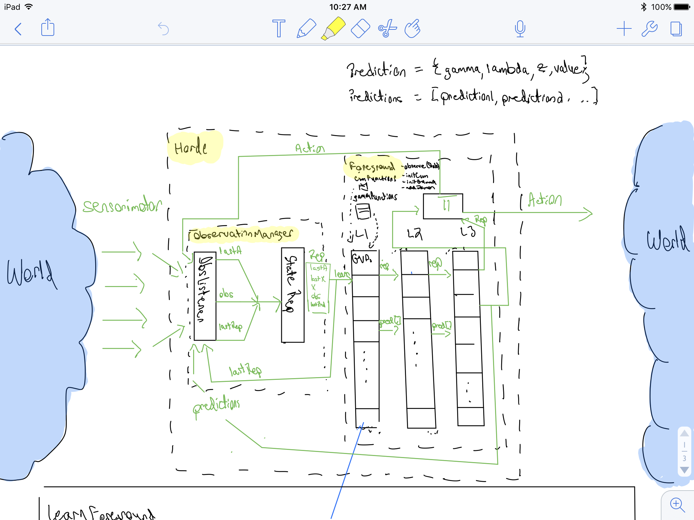
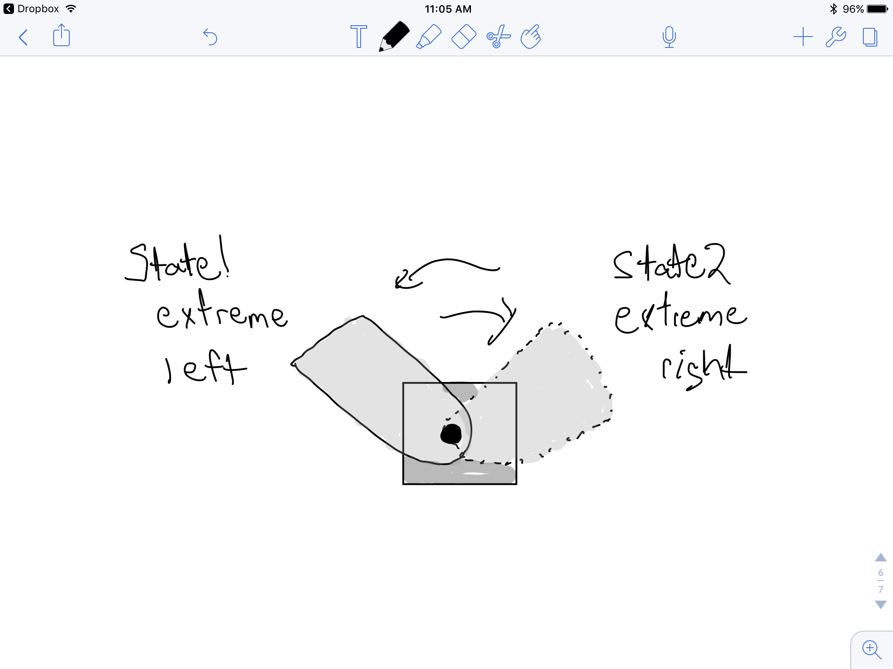
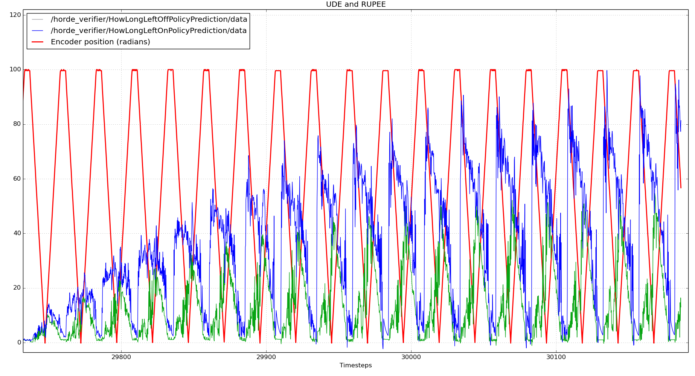
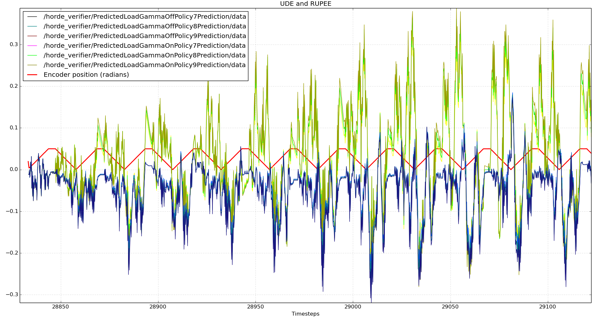
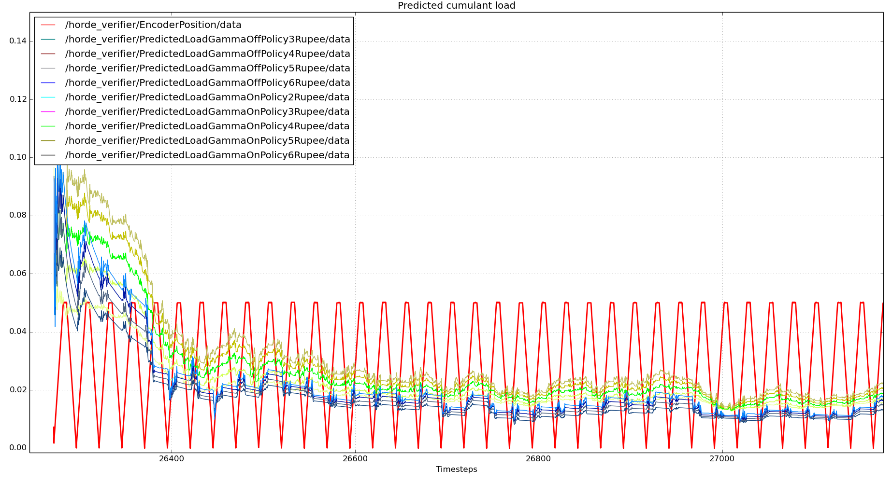
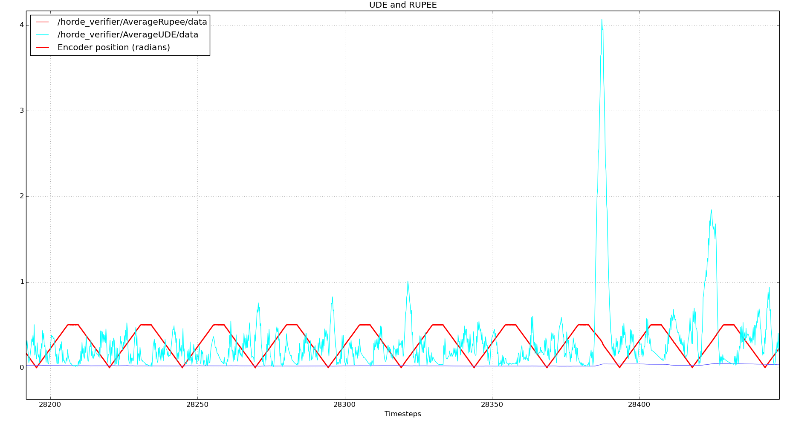
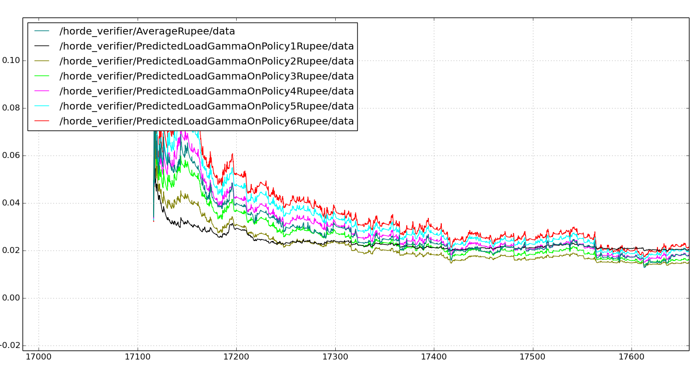
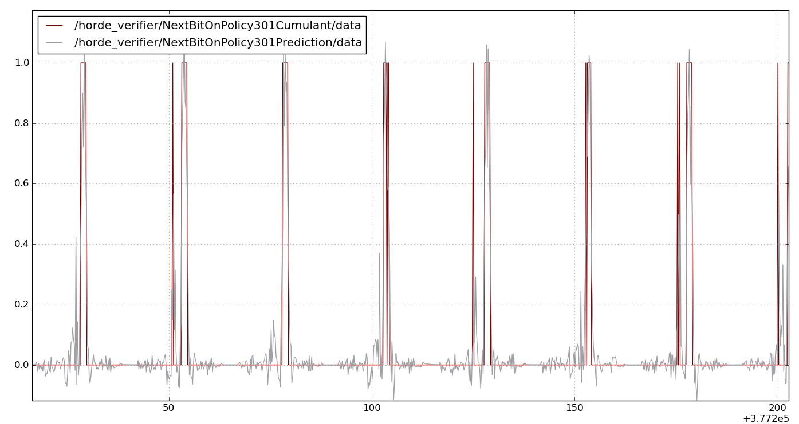

#Horde and Pavlovian Control

##Abstract:
We have previously demonstrated an ability to answer predictive questions using sensorimotor data in real time, provided by our robots. It has been hypothesized that an agent may form the basis of knowledge using these predictions - a clearly powerful utility.. 

Until this point however, the work we have done was to simply answer one single question as our robot experiences the world. A very limiting amount of knowledge. A natural next step would be to answer many questions simultaneously in such a way that 1) would allow more abstract questions to be answered that build off previous questions. and 2) allow behavior to change based upon these predictions. 

In this module, we look to build such an architecture and run various experiments that 
- Answer several interesting off policy and on policy questions simultaneously (see [Horde for information about General value functions](https://www.cs.swarthmore.edu/~meeden/DevelopmentalRobotics/horde1.pdf)) and to then change behavior based on one of these predictions (See [Prediction Driven Behavior](http://webdocs.cs.ualberta.ca/~sutton/papers/MS-AAAIws-2014.pdf) for more information about Pavlovian control).
- Measure the error of the answers in real time using Recent Unsigned Projected Error Estimates (RUPEE) and Unexpected Demon Error (UDE). *See [Adam White's PHD Thesis for RUPEE and UDE information](http://homes.soic.indiana.edu/adamw/phd.pdf)

Before explaining the experiments, a brief description of the architecture designed is given.


##Horde architecture:
[ROS](www.ros.org) was used, mainly to manage communications between various components, as well as for plotting. The following is a diagram outlining the main components - which are described later.



###Horde: 
The conceptual “brain” of our system. Contains the 2 main components that coordinate together: Observation Manager and Foreground.

###Observation Manager: 
The component responsible to generate our state representation by listening for all sensorimotor data, actions, and predictions. Once a state representation is generated, the information is republishing for the foreground to learn further and take actions. It may not be obvious why this observation manager is needed, or why it’s decoupled from the “foreground.” For our robot, indeed this design may not be required. However, many robots receive sensorimotor information at various different frequencies. Such a design allows us to group this data into the most recent observation and publish at whatever frequency we wish. This frequency may be aggressive and republish data as quickly as it’s received. But having an observation manager allows us to control learning rates independent of observation rates. 

###Foreground: 
This component is responsible for observing the data from the observation manager, publishing the next action, and learning from the observation. Furthermore, it contains factory methods for generating dynamic GVFs that have different gamma, policy, and cumulant functions. In the future, these factory methods could be used to create a more organic set of demons. Finally, the foreground contains a collection of demons, which can be set up in such a way as to feed predictions forward to other GVFs at different layers.


##Experiment 1: How long until we get there?

In this experiment we wanted to predict how long, from any position, it would take for the actuator to rotate all the way to the extreme right. But unlike the previous robot module, we wanted to predict this using both an on and off policy question simultaneously. Limiting the GVF’s to just 2 was a good first experiment to ensure the architecture was working correctly and could be scaled beyond 2 GVFs in the horde. 



2 GVFs were created that would answer these questions. They both contained a state conditional gamma value which would equal 1 in all states except the extreme right, which would have a value of 0. One was on policy, and the other GVF was off, with a target policy of always moving right.

```python
def createHowLongUntilLeftGVFs():
    #Create GVFs that predict how long it takes to get to the end. One on policy. And one off policy - going straight there.

    gvfs = []

    gvfOn = GVF(TileCoder.numberOfTiles*TileCoder.numberOfTiles * TileCoder.numberOfTilings, 0.1 / TileCoder.numberOfTilings, isOffPolicy = False, name = "HowLongLeftOnPolicy")
    gvfOn.gamma = atLeftGamma
    gvfOn.cumulant = timestepCumulant

    gvfs.append(gvfOn)

    gvfOff = GVF(TileCoder.numberOfTiles * TileCoder.numberOfTiles * TileCoder.numberOfTilings, 0.1 / TileCoder.numberOfTilings, isOffPolicy=True, name = "HowLongLeftOffPolicy")
    gvfOff.gamma = atLeftGamma
    gvfOff.cumulant = timestepCumulant
    gvfOff.policy = directLeftPolicy

    gvfs.append(gvfOff)

    return gvfs

````

where tilestepCumulant and atLeftGamma are function pointers.

```python
def atLeftGamma(state):
    if state.encoder >=1020.0:
        return 0
    else:
        return 1

def timestepCumulant(state):
    return 1

````

###Results.
For this experiment, we actually know the correct answer, simply through observation. From the opposite extreme, it is approximately 50 steps to the other extreme. So for the on policy behavior, the value approaches zero as it gets to the extreme. Then once it begins to move away, it spikes to 100 and slowly goes back to zero. For the off policy question, the value just moves smoothly between 0 and 50. This is indeed what we were able to observe.  More learning would be needed to smooth the curves but you see the effect easy below.



##Experiment 2 - Predicting cumulating load
Given that our basic architecture seems to be working, I wanted to measure the predicted cumulating load at various different time steps (1-10). I wanted to do so both for on policy and off policy. The same oscillating behavior policy was used. But now, 10 GVFs were created dynamically with gammas corresponding to time steps {1, 2, … 10}. 10 other GVF’s were created but whose target policy was to move directly to the extreme right. 

Code for instantiating the appropriate GVFs including a factory function to create the appropriate gamma functions dynamically.

```python

def makeGammaFunction(gamma):
    def gammaFunction(state):
        return gamma
    return gammaFunction

```

```python
def createPredictLoadGVFs():
    #GVFS that predict how much future load at different timesteps on and off policy
    #Create On policy GVFs for gamma values that correspond to timesteps: {1,2,3,4,5,6,7,8,9,10}.
    #Create Off policy GVFs for the same gamma values

    gvfs = []

    for i in range(1, 10, 1):
        #T = 1/(1-gamma)
        #gamma = (T-1)/T
        gamma = (i-1.0)/i

        #Create On policy gvf

        gvfOnPolicy = GVF(TileCoder.numberOfTiles*TileCoder.numberOfTiles * TileCoder.numberOfTilings, 0.1 / TileCoder.numberOfTilings, isOffPolicy = False, name = "PredictedLoadGammaOnPolicy" + str(i))
        gvfOnPolicy.gamma = makeGammaFunction(gamma)
        gvfOnPolicy.cumulant = loadCumulant

        gvfs.append(gvfOnPolicy)

        #Create Off policy gvf
        gvOffPolicy = GVF(TileCoder.numberOfTiles*TileCoder.numberOfTiles * TileCoder.numberOfTilings, 0.1 / TileCoder.numberOfTilings, isOffPolicy = True, name = "PredictedLoadGammaOffPolicy" + str(i))
        gvOffPolicy.gamma = makeGammaFunction(gamma)
        gvOffPolicy.cumulant = loadCumulant
        gvOffPolicy.policy = directLeftPolicy

        gvfs.append(gvOffPolicy)

    return gvfs

````

###Results:
The GVF’s were able to predict the load simultaneously for both on and off cumulant loads. Notice in the graph below, that as the actuator is moving right (the red cumulant curve increases), the on target and off target predictions merge. However, once the extreme right has been achieved, the predictions start to diverge. This is because the on policy GVF is predicting a very different value when moving left, but the same when moving right. You can see this in the graph below.



Up until now, error measures have not been plotted. The graph below shows the RUPEE errors over a number of time steps shown to be decreasing. You can see that for the off policy GVF’s, (the ones shaded blue), the RUPEE measure flatlines while the actuator is moving to the left (ie. not following the target policy.)



To further test UDE, after the the actuator had completed several oscillations, manual resistance  to the actuator were provided by physically pushing back on it. This spiked the UDE measure as the prediction for load was suddenly very erroneous. After I released the actuator, the UDE quickly decreased again. After another oscillation, manual resistance was provided again, which again spiked the UDE measure.



##Experiment 3 - Pavlov control
To demonstrate an ability to immediately alter behavior if a certain prediction is made, a new experiment was created. This experiment would have the robot reverse directions if it predicted it was close to the right most extreme (akin to hitting a wall). Unlike experiment 1 which predicted time steps to the extreme, the off policy GVF for this experiment was predicting the next encoder position. The behavior policy was altered such that if the off policy prediction became greater than 900 radians (it was close to the extreme value of 1023), the action taken would be to move the opposite direction. 

Below is a graph showing the execution of the robot throughout this experiment. Pay particular attention to the encoder position. For the first few cycles, the encoder oscillates between ~1023 and 510 (as expected). However, quite quickly, the demon begins to predict when it will get to within 900, and quickly alters direction. This is seen by the blue lines (encoder position) increasing to 1023 for the first 2 oscillations, but then reversing direction at around 900 radians the third time. 



##Experiment 4 - Predicting the bit stream
Thus far, we’ve demonstrated pavlovian control, as well as an ability to have several GVFs simultaneously learning with different gammas and policies. What we wanted to do next was to stress test the architecture to see how many GVFs could learn simultaneously.

With this goal in mind, GVF’s were created that would attempt to predict the next bit for all of the 512 contained in the feature vector. This was done for both off policy and on policy. Doing so required 512 unique cumulant functions, each returning a different value from the vector, The factory method dynamically generated each of these cumulant functions for each of the GVF’s. Therefor, 512 GVF’s were created to test the on policy bits and 512 were created to predict the off policy bits, a total of 1024 running simultaneously. (not without performance issues described below).

```python
def createNextBitGVFs():
    gvfs = []
    vectorSize = TileCoder.numberOfTiles * TileCoder.numberOfTiles * TileCoder.numberOfTilings

    for i in range(0, vectorSize, 1):
        gvfOn = GVF(TileCoder.numberOfTiles*TileCoder.numberOfTiles * TileCoder.numberOfTilings, 0.1 / TileCoder.numberOfTilings, isOffPolicy = False, name = "NextBitOnPolicy"+ str(i))
        gvfOn.cumulant = makeVectorBitCumulantFunction(i)
        gvfs.append(gvfOn)
        gvfOff = GVF(TileCoder.numberOfTiles * TileCoder.numberOfTiles * TileCoder.numberOfTilings, 0.1 / TileCoder.numberOfTilings, isOffPolicy=True, name = "NextBitOffPolicy"+ str(i))
        gvfOff.cumulant = makeVectorBitCumulantFunction(i)
        gvfOff.policy = directLeftPolicy
        gvfs.append(gvfOff)

    return gvfs

```

Results:
Updating each GVF took, on average 0.09 seconds. This was plenty of time, in theory, given that observations were received every 0.2 seconds. However, there were occasions when my CPU decided to take on some other task, and learning took much longer than 0.2 seconds. This introduced significant latency when performing actions. This latency in decision making wouldn’t be acceptable for a robot which needs to make action decisions instantaneously. Furthermore, 0.2 seconds is incredibly generous. A robot would want to be making decisions and learning at a much faster rate. Clearly, optimizations would be needed to support any real time robot wishing to make this scale of predictions. That said, we were able to make predictions at this scale.

This is a plot of one of the bits compared to it’s actual value over a long period of time



##Conclusion: 
Throughout this module, we demonstrated 
- Over 1000 GVF’s running in parallel.
- On policy and off policy GVF’s running simultaneously. 
- Several different gamma, cumulant, and policy functions for GVF’s running simultaneously.
- Using RUPEE and UDE to measure error in the learners.
- Using the prediction of a GVF for pavlovian control.

A possible next step would be to 
- Attempt to create multiple layers of GVF’s, with increasing abstraction. The architecture is such that this extension should be quite seamless. 
- Increase the performance when many GVF’s are running simultaneously - as expressed in Experiment 4